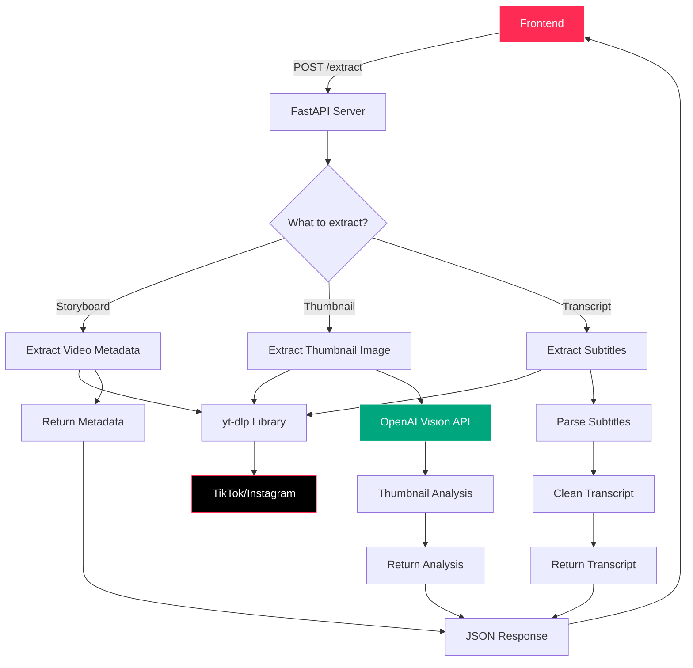
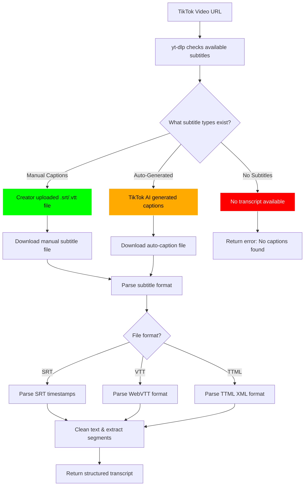

# Video Scraper Service - Backend Architecture

## Simple Backend Flow



## What the Backend Does

### 1. **Storyboard Generation**
- Takes TikTok URL
- Extracts video metadata (title, description, duration)
- Returns structured data for pattern analysis

### 2. **Thumbnail Analysis** 
- Downloads video thumbnail
- Sends to OpenAI Vision API
- Returns visual insights (style, setting, colors)

### 3. **Transcript Extraction**
- Gets available subtitles from video
- Parses and cleans the text
- Returns timestamped transcript

## How TikTok Transcript Generation Actually Works



## TikTok Subtitle Types

### 1. **Manual Captions** (Best Quality)
- Creator manually uploaded subtitle files
- Usually in SRT or VTT format
- Perfect timing and accurate text
- Available in multiple languages

### 2. **Auto-Generated Captions** (AI-Generated)
- TikTok's AI automatically creates captions
- Generated from audio analysis
- Less accurate but still useful
- Available for most videos with clear audio

### 3. **No Captions** 
- Video has no audio or unclear speech
- Creator disabled caption generation
- Private/restricted content

## What yt-dlp Actually Downloads

When you request a TikTok video, yt-dlp can access:

```
Example subtitle files TikTok provides:
- video_id.en.srt (English manual captions)
- video_id.en.vtt (English WebVTT format)
- video_id.auto.srt (Auto-generated English)
- video_id.id.srt (Indonesian captions)
- video_id.auto.id.srt (Auto-generated Indonesian)
```

## Subtitle File Example

```srt
1
00:00:00,000 --> 00:00:03,200
Hey guys, welcome back to my channel!

2
00:00:03,200 --> 00:00:06,800
Today I'm going to show you this amazing product

3
00:00:06,800 --> 00:00:10,500
that completely changed my morning routine
```

## Why Some Videos Don't Have Transcripts

1. **No Audio**: Video is music-only or silent
2. **Unclear Speech**: Audio quality too poor for AI
3. **Private Settings**: Creator disabled captions
4. **Language Support**: TikTok doesn't support the spoken language
5. **Copyright Issues**: Audio content is copyrighted

## Tech Stack

- **FastAPI** - Web framework
- **yt-dlp** - Video extraction library  
- **OpenAI Vision** - Thumbnail analysis
- **Python** - Programming language
