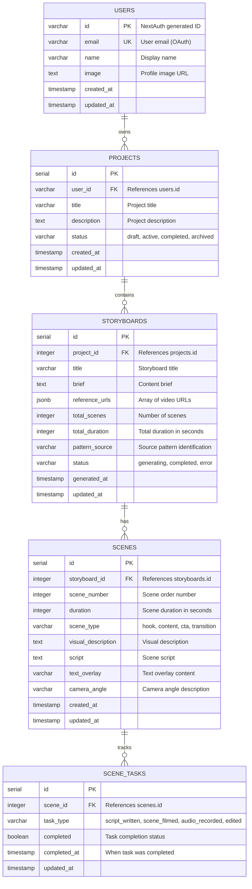
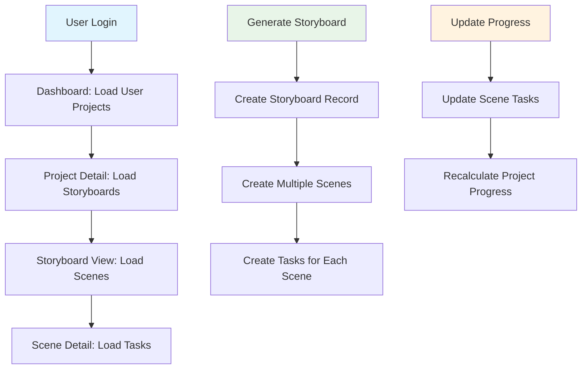

# StoryboardAI Database Design Documentation

## Overview

This document outlines the database architecture for StoryboardAI, a SaaS platform for generating video storyboards. The design prioritizes scalability, performance, and data consistency while supporting the core features of project management, storyboard generation, and user progress tracking.

## Technology Stack

- **Development**: SQLite (local development)
- **Production**: PostgreSQL (Vercel Postgres)
- **ORM**: Drizzle ORM (type-safe, lightweight, performant)
- **Migrations**: Drizzle Kit
- **Connection Pool**: Built-in PostgreSQL pooling

## Database Schema

### Entity Relationship Diagram



### Relationship Summary

| Relationship | Type | Description | Cascade Behavior |
|--------------|------|-------------|------------------|
| Users → Projects | One-to-Many | Each user can have multiple projects | CASCADE DELETE |
| Projects → Storyboards | One-to-Many | Each project can contain multiple storyboard variations | CASCADE DELETE |
| Storyboards → Scenes | One-to-Many | Each storyboard consists of multiple ordered scenes | CASCADE DELETE |
| Scenes → Scene Tasks | One-to-Many | Each scene has multiple progress tracking tasks | CASCADE DELETE |

### Data Flow & Access Patterns



### Key Constraints & Business Rules

#### Primary Constraints
```sql
-- Unique scene numbers within each storyboard
UNIQUE(storyboard_id, scene_number)

-- One task per type per scene
UNIQUE(scene_id, task_type)

-- User email uniqueness
UNIQUE(email)
```

#### Business Logic Constraints
```sql
-- Project status validation
CHECK (status IN ('draft', 'active', 'completed', 'archived'))

-- Storyboard status validation  
CHECK (status IN ('generating', 'completed', 'error'))

-- Scene type validation
CHECK (scene_type IN ('hook', 'content', 'cta', 'transition'))

-- Task type validation
CHECK (task_type IN ('script_written', 'scene_filmed', 'audio_recorded', 'edited'))
```

### Core Entities

#### 1. Users Table
```sql
CREATE TABLE users (
  id VARCHAR(255) PRIMARY KEY,           -- NextAuth generated ID
  email VARCHAR(255) UNIQUE NOT NULL,   -- User email (OAuth)
  name VARCHAR(255),                    -- Display name
  image TEXT,                           -- Profile image URL
  created_at TIMESTAMP DEFAULT NOW(),
  updated_at TIMESTAMP DEFAULT NOW()
);

-- Indexes
CREATE INDEX idx_users_email ON users(email);
CREATE INDEX idx_users_created_at ON users(created_at);
```

**Scalability Notes:**
- Uses VARCHAR for ID to support various OAuth providers
- Email index for fast user lookups
- Timestamp indexes for analytics queries

#### 2. Projects Table
```sql
CREATE TABLE projects (
  id SERIAL PRIMARY KEY,
  user_id VARCHAR(255) NOT NULL REFERENCES users(id) ON DELETE CASCADE,
  title VARCHAR(255) NOT NULL,
  description TEXT,
  status VARCHAR(20) DEFAULT 'active' CHECK (status IN ('draft', 'active', 'completed', 'archived')),
  created_at TIMESTAMP DEFAULT NOW(),
  updated_at TIMESTAMP DEFAULT NOW()
);

-- Indexes
CREATE INDEX idx_projects_user_id ON projects(user_id);
CREATE INDEX idx_projects_status ON projects(status);
CREATE INDEX idx_projects_updated_at ON projects(updated_at);
CREATE INDEX idx_projects_user_status ON projects(user_id, status);
```

**Scalability Notes:**
- Composite index on (user_id, status) for efficient user project filtering
- Cascade delete ensures data consistency
- Status enum for query optimization

#### 3. Storyboards Table
```sql
CREATE TABLE storyboards (
  id SERIAL PRIMARY KEY,
  project_id INTEGER NOT NULL REFERENCES projects(id) ON DELETE CASCADE,
  title VARCHAR(255) NOT NULL,
  brief TEXT NOT NULL,
  reference_urls JSONB,                 -- Array of video URLs
  total_scenes INTEGER DEFAULT 0,
  total_duration INTEGER DEFAULT 0,     -- Total duration in seconds
  pattern_source VARCHAR(255),          -- Source pattern identification
  status VARCHAR(20) DEFAULT 'generating' CHECK (status IN ('generating', 'completed', 'error')),
  generated_at TIMESTAMP DEFAULT NOW(),
  updated_at TIMESTAMP DEFAULT NOW()
);

-- Indexes
CREATE INDEX idx_storyboards_project_id ON storyboards(project_id);
CREATE INDEX idx_storyboards_status ON storyboards(status);
CREATE INDEX idx_storyboards_generated_at ON storyboards(generated_at);
CREATE GIN INDEX idx_storyboards_reference_urls ON storyboards USING GIN (reference_urls);
```

**Scalability Notes:**
- JSONB for flexible URL storage with GIN index for querying
- Separate status tracking for generation pipeline
- Foreign key constraints maintain referential integrity

#### 4. Scenes Table
```sql
CREATE TABLE scenes (
  id SERIAL PRIMARY KEY,
  storyboard_id INTEGER NOT NULL REFERENCES storyboards(id) ON DELETE CASCADE,
  scene_number INTEGER NOT NULL,
  duration INTEGER DEFAULT 0,           -- Scene duration in seconds
  scene_type VARCHAR(20) DEFAULT 'content' CHECK (scene_type IN ('hook', 'content', 'cta', 'transition')),
  visual_description TEXT NOT NULL,
  script TEXT,
  text_overlay VARCHAR(500),
  camera_angle VARCHAR(100),
  created_at TIMESTAMP DEFAULT NOW(),
  updated_at TIMESTAMP DEFAULT NOW(),
  
  -- Ensure scene numbers are unique within a storyboard
  UNIQUE(storyboard_id, scene_number)
);

-- Indexes
CREATE INDEX idx_scenes_storyboard_id ON scenes(storyboard_id);
CREATE INDEX idx_scenes_type ON scenes(scene_type);
CREATE INDEX idx_scenes_storyboard_scene_number ON scenes(storyboard_id, scene_number);
```

**Scalability Notes:**
- Unique constraint on (storyboard_id, scene_number) prevents duplicates
- Scene type indexing for analytics on content patterns
- Optimized for ordered scene retrieval

#### 5. Scene Tasks Table
```sql
CREATE TABLE scene_tasks (
  id SERIAL PRIMARY KEY,
  scene_id INTEGER NOT NULL REFERENCES scenes(id) ON DELETE CASCADE,
  task_type VARCHAR(30) NOT NULL CHECK (task_type IN ('script_written', 'scene_filmed', 'audio_recorded', 'edited')),
  completed BOOLEAN DEFAULT FALSE,
  completed_at TIMESTAMP NULL,
  updated_at TIMESTAMP DEFAULT NOW(),
  
  -- One task per type per scene
  UNIQUE(scene_id, task_type)
);

-- Indexes
CREATE INDEX idx_scene_tasks_scene_id ON scene_tasks(scene_id);
CREATE INDEX idx_scene_tasks_completed ON scene_tasks(completed);
CREATE INDEX idx_scene_tasks_type ON scene_tasks(task_type);
```

**Scalability Notes:**
- Unique constraint prevents duplicate task types per scene
- Boolean indexing for fast progress calculations
- Separate completion timestamps for analytics

## Performance Optimizations

### 1. Query Patterns & Indexes

#### Common Query: User's Projects with Storyboard Counts
```sql
-- Optimized query with proper indexing
SELECT 
  p.id,
  p.title,
  p.description,
  p.status,
  p.created_at,
  p.updated_at,
  COUNT(s.id) as storyboard_count
FROM projects p
LEFT JOIN storyboards s ON p.id = s.project_id
WHERE p.user_id = $1
GROUP BY p.id, p.title, p.description, p.status, p.created_at, p.updated_at
ORDER BY p.updated_at DESC;

-- Required indexes:
-- idx_projects_user_id (primary filter)
-- idx_storyboards_project_id (join optimization)
```

#### Common Query: Project Details with Complete Hierarchy
```sql
-- Efficient hierarchical data retrieval
WITH project_data AS (
  SELECT * FROM projects WHERE id = $1 AND user_id = $2
),
storyboard_data AS (
  SELECT s.*, COUNT(sc.id) as scene_count
  FROM storyboards s
  LEFT JOIN scenes sc ON s.id = sc.storyboard_id
  WHERE s.project_id = $1
  GROUP BY s.id
),
scene_data AS (
  SELECT sc.*, COUNT(st.id) as total_tasks, COUNT(st.id) FILTER (WHERE st.completed = true) as completed_tasks
  FROM scenes sc
  LEFT JOIN scene_tasks st ON sc.id = st.scene_id
  WHERE sc.storyboard_id IN (SELECT id FROM storyboard_data)
  GROUP BY sc.id
)
-- Combine results efficiently
```

### 2. Connection Pooling
```typescript
// Production configuration
const pool = new Pool({
  connectionString: process.env.DATABASE_URL,
  max: 20,                    // Maximum connections
  min: 5,                     // Minimum connections
  idleTimeoutMillis: 30000,   // Close idle connections
  connectionTimeoutMillis: 2000,
  statement_timeout: 30000,   // Query timeout
});
```

### 3. Drizzle ORM Optimizations
```typescript
// Efficient batch operations
const db = drizzle(pool);

// Prepared statements for repeated queries
const getUserProjects = db
  .select()
  .from(projects)
  .where(eq(projects.userId, placeholder('userId')))
  .prepare();

// Optimized joins with select specific fields
const projectWithCounts = db
  .select({
    id: projects.id,
    title: projects.title,
    storyboardCount: count(storyboards.id),
  })
  .from(projects)
  .leftJoin(storyboards, eq(projects.id, storyboards.projectId))
  .where(eq(projects.userId, userId))
  .groupBy(projects.id);
```

## Scalability Strategies

### 1. Horizontal Scaling Preparation

#### Read Replicas Strategy
```typescript
// Database configuration for read/write splitting
const writeDB = drizzle(writePool);
const readDB = drizzle(readPool);

// Query routing
export const dbQueries = {
  // Write operations use primary
  createProject: (data) => writeDB.insert(projects).values(data),
  updateProject: (id, data) => writeDB.update(projects).set(data).where(eq(projects.id, id)),
  
  // Read operations use replica
  getUserProjects: (userId) => readDB.select().from(projects).where(eq(projects.userId, userId)),
  getProjectDetails: (id) => readDB.select().from(projects).where(eq(projects.id, id)),
};
```

#### Sharding Preparation
```sql
-- User-based sharding strategy
-- Shard key: user_id hash
-- Example: users with ID hash % 4 = 0 go to shard_0

-- Add shard_id to track data location
ALTER TABLE projects ADD COLUMN shard_id INTEGER DEFAULT 0;
CREATE INDEX idx_projects_shard_id ON projects(shard_id);
```

### 2. Caching Strategies

#### Application-Level Caching
```typescript
// Redis caching for frequently accessed data
import Redis from 'ioredis';

const redis = new Redis(process.env.REDIS_URL);

// Cache user projects for 5 minutes
export const getCachedUserProjects = async (userId: string) => {
  const cacheKey = `user:${userId}:projects`;
  const cached = await redis.get(cacheKey);
  
  if (cached) {
    return JSON.parse(cached);
  }
  
  const projects = await db.getUserProjects(userId);
  await redis.setex(cacheKey, 300, JSON.stringify(projects));
  return projects;
};

// Invalidate cache on updates
export const invalidateUserProjectsCache = (userId: string) => {
  redis.del(`user:${userId}:projects`);
};
```

#### Database Query Caching
```sql
-- PostgreSQL query result caching
-- Use pg_stat_statements for query analysis
CREATE EXTENSION IF NOT EXISTS pg_stat_statements;

-- Materialized views for heavy aggregations
CREATE MATERIALIZED VIEW user_project_stats AS
SELECT 
  user_id,
  COUNT(*) as total_projects,
  COUNT(*) FILTER (WHERE status = 'active') as active_projects,
  MAX(updated_at) as last_activity
FROM projects
GROUP BY user_id;

-- Refresh strategy (daily)
CREATE OR REPLACE FUNCTION refresh_user_stats()
RETURNS void AS $$
BEGIN
  REFRESH MATERIALIZED VIEW CONCURRENTLY user_project_stats;
END;
$$ LANGUAGE plpgsql;
```

### 3. Archive Strategy

#### Data Lifecycle Management
```sql
-- Archive old completed projects
CREATE TABLE projects_archive (
  LIKE projects INCLUDING ALL
);

-- Automated archiving procedure
CREATE OR REPLACE FUNCTION archive_old_projects()
RETURNS void AS $$
BEGIN
  -- Move projects older than 2 years and completed
  WITH archived_projects AS (
    DELETE FROM projects 
    WHERE status = 'completed' 
    AND updated_at < NOW() - INTERVAL '2 years'
    RETURNING *
  )
  INSERT INTO projects_archive 
  SELECT * FROM archived_projects;
  
  -- Archive related data
  -- (Similar process for storyboards, scenes, scene_tasks)
END;
$$ LANGUAGE plpgsql;

-- Schedule via cron or external job
```

## Migration Strategies

### 1. Schema Versioning
```typescript
// Drizzle migration structure
// migrations/
//   0001_initial_schema.sql
//   0002_add_project_status.sql
//   0003_add_performance_indexes.sql

// Migration with zero downtime
export const addColumnSafely = async () => {
  // 1. Add column as nullable
  await db.execute(`ALTER TABLE projects ADD COLUMN new_field TEXT`);
  
  // 2. Backfill data (in batches)
  await backfillInBatches();
  
  // 3. Add NOT NULL constraint (if needed)
  await db.execute(`ALTER TABLE projects ALTER COLUMN new_field SET NOT NULL`);
};
```

### 2. Data Migration Patterns
```typescript
// Large data migrations with progress tracking
export const migrateUserData = async () => {
  const batchSize = 1000;
  let offset = 0;
  let processed = 0;
  
  while (true) {
    const batch = await db
      .select()
      .from(users)
      .limit(batchSize)
      .offset(offset);
    
    if (batch.length === 0) break;
    
    // Process batch
    await processBatch(batch);
    
    offset += batchSize;
    processed += batch.length;
    
    console.log(`Processed ${processed} users`);
    
    // Prevent overwhelming the database
    await sleep(100);
  }
};
```

## Monitoring & Analytics

### 1. Performance Monitoring
```sql
-- Query performance tracking
SELECT 
  query,
  calls,
  total_time,
  mean_time,
  rows
FROM pg_stat_statements 
ORDER BY total_time DESC 
LIMIT 10;

-- Index usage analysis
SELECT 
  schemaname,
  tablename,
  indexname,
  idx_scan,
  idx_tup_read,
  idx_tup_fetch
FROM pg_stat_user_indexes 
ORDER BY idx_scan DESC;
```

### 2. Business Metrics
```sql
-- User engagement metrics
CREATE VIEW user_engagement_metrics AS
SELECT 
  DATE_TRUNC('day', created_at) as date,
  COUNT(DISTINCT user_id) as daily_active_users,
  COUNT(*) as projects_created,
  AVG(
    SELECT COUNT(*) 
    FROM storyboards s 
    WHERE s.project_id = p.id
  ) as avg_storyboards_per_project
FROM projects p
GROUP BY DATE_TRUNC('day', created_at)
ORDER BY date DESC;
```

## Security Considerations

### 1. Data Protection
```sql
-- Row Level Security (RLS)
ALTER TABLE projects ENABLE ROW LEVEL SECURITY;

CREATE POLICY projects_user_isolation ON projects
  FOR ALL 
  TO authenticated_user
  USING (user_id = current_setting('app.current_user_id'));

-- Audit logging
CREATE TABLE audit_log (
  id SERIAL PRIMARY KEY,
  table_name VARCHAR(50),
  operation VARCHAR(10),
  user_id VARCHAR(255),
  old_values JSONB,
  new_values JSONB,
  created_at TIMESTAMP DEFAULT NOW()
);
```

### 2. Data Backup Strategy
```bash
# Automated daily backups
pg_dump \
  --host=$DB_HOST \
  --port=$DB_PORT \
  --username=$DB_USER \
  --dbname=$DB_NAME \
  --format=custom \
  --compress=9 \
  --file="backup_$(date +%Y%m%d_%H%M%S).dump"

# Point-in-time recovery setup
# Configure PostgreSQL with WAL archiving
```

## Cost Optimization

### 1. Query Optimization
- Use EXPLAIN ANALYZE for all critical queries
- Implement proper indexing strategies
- Optimize N+1 queries with joins
- Use connection pooling

### 2. Storage Optimization
```sql
-- Compress large text fields
CREATE TABLE storyboards (
  -- ... other fields
  brief TEXT COMPRESSION lz4,  -- PostgreSQL 14+
  -- ... 
);

-- Partition large tables by date
CREATE TABLE audit_log (
  -- ... fields
  created_at TIMESTAMP NOT NULL
) PARTITION BY RANGE (created_at);

CREATE TABLE audit_log_2024 PARTITION OF audit_log
  FOR VALUES FROM ('2024-01-01') TO ('2025-01-01');
```

## Current Limitations & Future Improvements

### Current State
- Single database instance
- Limited to Vercel Postgres constraints
- Basic indexing strategy
- No caching layer

### Planned Improvements
1. **Phase 1**: Add Redis caching layer
2. **Phase 2**: Implement read replicas
3. **Phase 3**: Add comprehensive monitoring
4. **Phase 4**: Implement data archiving
5. **Phase 5**: Consider sharding for large scale

### Scale Milestones
- **1K users**: Current architecture sufficient
- **10K users**: Add caching and read replicas
- **100K users**: Implement sharding strategy
- **1M+ users**: Multi-region deployment

---

*Last updated: July 2024*
*Next review: August 2024*D
